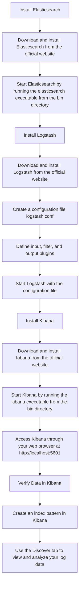

Here's a Mermaid chart that outlines the steps for setting up a log forwarder with Elasticsearch, Logstash, and Kibana:

This chart provides a visual representation of the steps involved in setting up the ELK stack for log forwarding. If you need further details or have any questions, feel free to ask!
